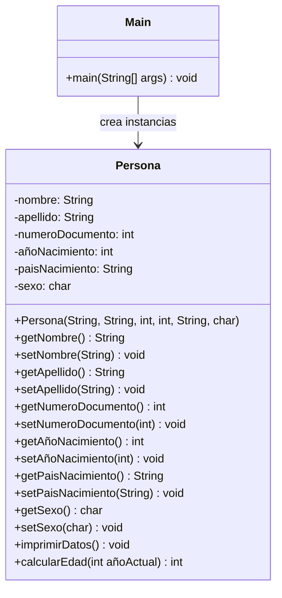

# Proyecto Ejercicio 1

## Diagrama de Clases

## Descripción

### Clase Main
Contiene el método `main` que es el punto de entrada de la aplicación. Crea dos instancias de `Persona` y muestra sus datos.

### Clase Persona
Clase que representa una persona con los siguientes atributos:
- **nombre**: Nombre de la persona
- **apellido**: Apellido de la persona
- **numeroDocumento**: Número de documento de identidad
- **añoNacimiento**: Año de nacimiento
- **paisNacimiento**: País de nacimiento
- **sexo**: Sexo de la persona ('M' o 'F')

Incluye getters y setters para todos los atributos, así como:
- `imprimirDatos()` que muestra la información de la persona en la consola.
- `calcularEdad(int añoActual)`, que devuelve la edad calculada según el año proporcionado.
